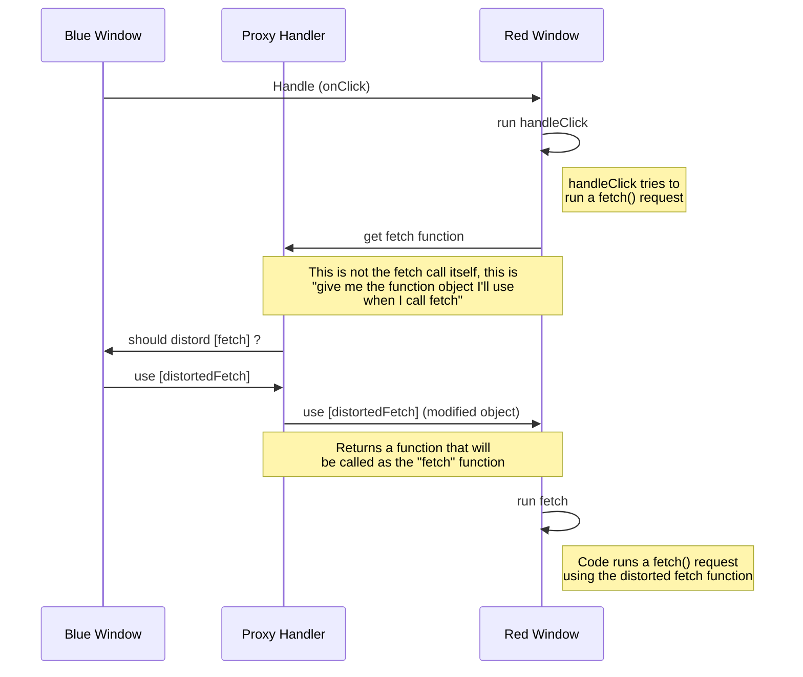

# Js Sandbox example

This is a simple exmaple of how to sandbox javascript code using iframes and proxies

# How does it work?

- Blue realm is the main realm
- Creates an iframe and extract its contentWindow
- Proxies any access to window attributes
  - NOTE: Using this same technique one could proxy any js instrinsic
- Evaluates code with eval (red realm) in the context of the contentWindow (red realm) (using with)
  - When evaluating this code endowments are added to the contentWindow
  - When the code tries to access any JS intrinsic (e.g. document.querySelector) it first goes to the proxy handler
  - The proxy handler decides what to return to the code, here the proxy calls the distortion callback that might decide to return something different.
- There’s no data serialization because all the objects are running in the same process.
- If the blue realm calls code from the red realm (e.g. an event handler). The red code still executes inside that original `with` when was first invoked, thus, is sandboxed.

# Diagram

# LICENSE

Apache 2
